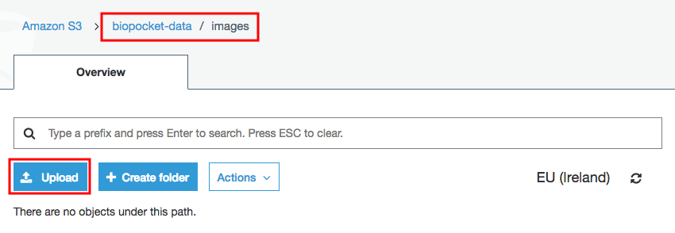
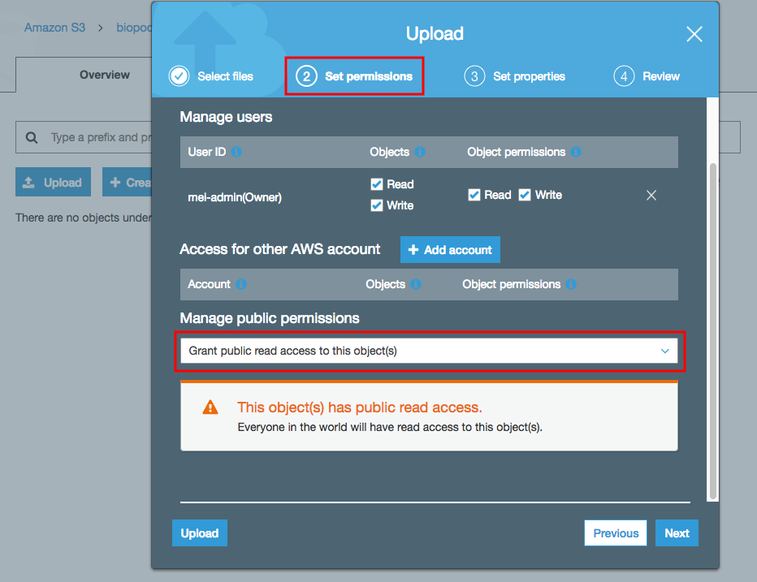
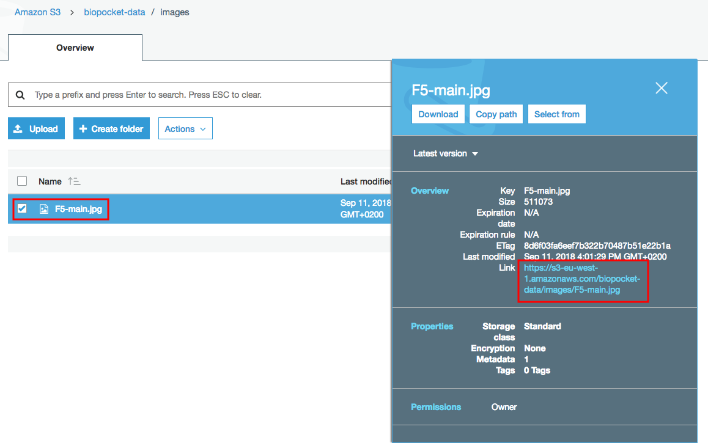
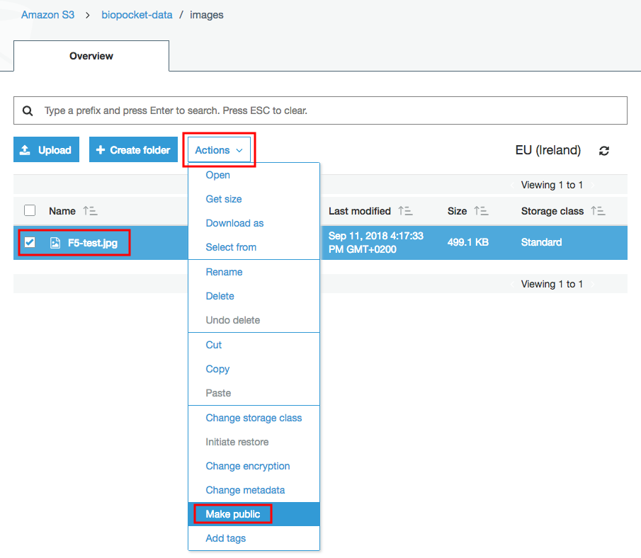

# Gestion des images BioPocket

<!-- START doctoc generated TOC please keep comment here to allow auto update -->
<!-- DON'T EDIT THIS SECTION, INSTEAD RE-RUN doctoc TO UPDATE -->

- [Convention de nommage](#convention-de-nommage)
- [Sauvegarde des images sur Amazon](#sauvegarde-des-images-sur-amazon)

<!-- END doctoc generated TOC please keep comment here to allow auto update -->

## Convention de nommage

À détailler...

## Sauvegarde des images sur Amazon

Naviguer à l'URL suivante et s'identifier:
https://s3.console.aws.amazon.com/s3/buckets/biopocket-data/images/?region=us-east-1&tab=overview

Vérifier de bien être dans le dossier `images` du bucket `biopocket-data`.
Le bouton **Upload** ouvre une fenêtre où l'on peut mettre les images à ajouter ou remplacer.

Lors de l'étape 2 **Set Permissions**, il est important de permettre l'accès public aux images (`Grant public read access to this object(s)`).
Sinon, elles ne seront pas disponibles publiquement.
L'avertissement affiché en-dessous est normal.

Une fois l'image (ou les images) envoyées, on peut accéder au lien d'une image en la sélectionnant dans la liste pour ouvrir les détails.
Ouvrir ce lien dans le navigateur devrait afficher l'image.

Si le lien mène vers une page indiquant une erreur `Access Denied`, c'est que les permissions de l'image n'ont pas été configurées correctement.
Il est possible de les corriger après coup en sélectionnant l'image dans la liste puis en cliquant sur le bouton **Make public** dans le menu déroulant **Actions**.

