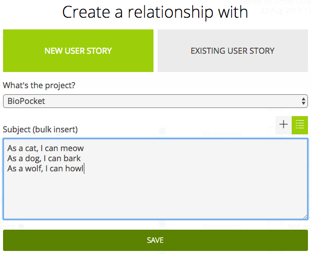

# User Story Cheat Sheet

Anyone in the team can contribute to writing user stories.

As a user story contributor, you will work in the first 3 columns of the [Kanban board](https://tree.taiga.io/project/mei-biopocket/kanban): **Brainstorm**, **Definition** and **Ready**.
New stories will appear in the **Brainstorm** column by default.
Move them from column to column when appropriate.

<table>
  <thead>
    <tr>
      <th>Step</th>
      <th>Who is responsible</th>
      <th>What to do</th>
    </tr>
  </thead>
  <tbody>
    <tr>
      <td></td>
      <td rowspan=3>Everyone</td>
      <td>
        Write your new story here. At this point, the story can be just a rough idea for a feature.
        It doesn't need to have any details or be designed.
      </td>
    </tr>
    <tr>
      <td></td>
      <td>
        Move the story here when you are ready to start defining it more precisely:
        <ul>
          <li>Everyone can write <strong>acceptance criteria</strong> and design <a href="https://comem.mybalsamiq.com/projects/biopocket/grid"><strong>wireframes (balsamiq)</strong></a>.</li>
          <li>Graphic designers can produce the <a href="https://xd.adobe.com/view/c3917f9c-2a66-4f0a-a5f6-e2c1f424079b/"><strong>mockups (adobe xd)</strong></a> (although that can also be done later as a technical task in the implementation phase).</li>
        </ul>
      </td>
    </tr>
    <tr>
      <td></td>
      <td>Move the story here once it is ready to be implemented. <strong>Assign</strong> it to a <strong>Product Owner</strong>.</td>
    </tr>
    <tr>
      <td colspan=4><a href="PROJECT-MANAGEMENT.md#user-story-workflow">See the full workflow</a></td>
    </tr>
  </tbody>
</table>

In a nutshell, you will:

<!-- START doctoc generated TOC please keep comment here to allow auto update -->
<!-- DON'T EDIT THIS SECTION, INSTEAD RE-RUN doctoc TO UPDATE -->

- [Write new stories](#write-new-stories)
- [Define stories](#define-stories)
  - [When is a story ready?](#when-is-a-story-ready)
- [Hand stories over to the Product Owner](#hand-stories-over-to-the-product-owner)

<!-- END doctoc generated TOC please keep comment here to allow auto update -->

## Write new stories

* Go to the [Epics board](https://tree.taiga.io/project/mei-biopocket/epics)
* Find an epic that fits the general subject of your story, or create one
* Open the epic and add a story:

  
* You can add multiple stories at the same time:

  

## Define stories

**Everyone** can write the story's **Acceptance Criteria**:

* Think UI (user interface):
  Which new screens must be added?
  How must existing screens be modified?
* Think UX (user interaction):
  What should happen when the user interacts with the UI?
  What kind of feedback is needed to let the user know that something happened or is happening?
  (Especially things that are not shown in the mockups or wireframes.)
* Think empty result set:
  What should be displayed if no data is available or no element matches the applied filters?
* Think validation:
  Are there inputs where the user can enter invalid data?
  Should validation error messages be displayed in some circumstances?
* Think of the worst case scenario:
  Should the user have some feedback if the server is unreachable or something fails?

Anyone in the **Development Team** can create [wireframes (balsamiq)](https://comem.mybalsamiq.com/projects/biopocket/grid) illustrating the story.

**Everyone** can post comments in balsamiq to discuss the wireframes.

**Graphic designers** can produce [mockups](https://xd.adobe.com/view/c3917f9c-2a66-4f0a-a5f6-e2c1f424079b/) at this stage,
or it can be done later as a technical task during implementation.

### When is a story ready?

Once all **Acceptance Criteria** have been defined and it has at least a **wireframe** or a **mockup**.

## Hand stories over to the Product Owner

When your story is ready, move it to the **Ready** column and **assign** it to a **Product Owner**.

The **Product Owner** will decide which stories to implement in which **Sprint**.

See the [full workflow](PROJECT-MANAGEMENT.md#user-story-workflow).
